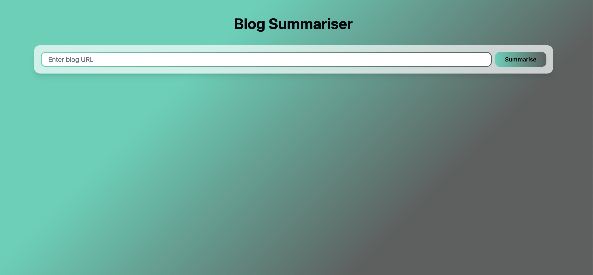
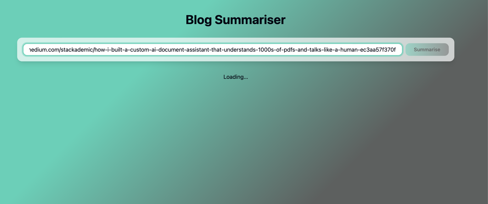
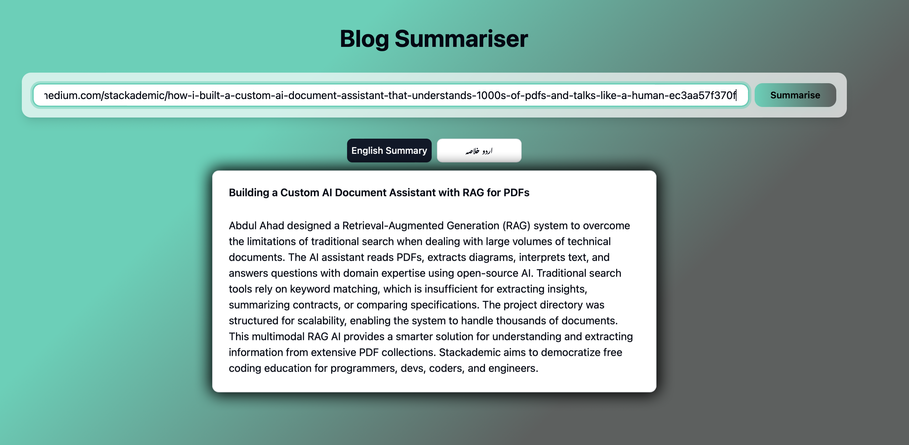
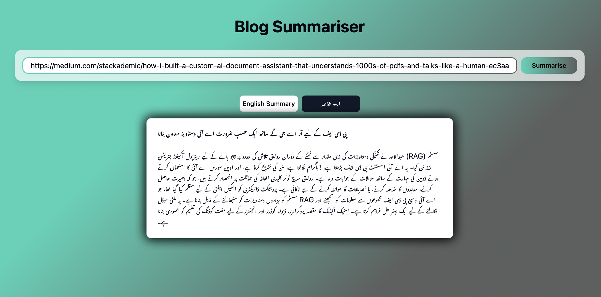

# 📰 Blog Summariser

>A modern web app to instantly summarise any blog in **English** and **Urdu** using the Gemini 2.0 Flash API. Built with Next.js and styled with [shadcn/ui](https://ui.shadcn.com/).

---

## ✨ Features

- 🌐 **URL Input**: Enter any blog URL to summarise.
- 🕸️ **Web Scraping**: Automatically scrapes blog content.
- 🤖 **AI Summarisation**: Uses Gemini 2.0 Flash API for concise summaries.
- 🇬🇧 **English & Urdu**: Get summaries in both languages.
- 🎨 **Modern UI**: Styled with shadcn/ui components for a sleek experience.

---

## 🚀 Tech Stack

- [Next.js 14 (App Router)](https://nextjs.org/)
- [TypeScript](https://www.typescriptlang.org/)
- [shadcn/ui](https://ui.shadcn.com/)
- [Gemini 2.0 Flash API](https://ai.google.dev/gemini-api/docs)
- [MongoDB & Supabase](https://www.mongodb.com/) (for storage, if enabled)

---

## 📁 Project Structure

```
├── public/                # Static assets (SVGs, icons)
├── src/
│   ├── app/
│   │   ├── api/
│   │   │   └── summarize/route.ts   # API route for summarisation
│   │   ├── layout.tsx
│   │   └── page.tsx
│   ├── components/
│   │   ├── ui/            # shadcn/ui components
│   │   │   ├── button.tsx
│   │   │   ├── card.tsx
│   │   │   ├── input.tsx
│   │   │   ├── SummaryCard.tsx
│   │   │   └── UrlForm.tsx
│   ├── lib/
│   │   ├── scraper.ts     # Blog scraping logic
│   │   ├── summariser.ts  # Gemini API integration
│   │   ├── translator.ts  # English/Urdu translation
│   │   ├── types.ts
│   │   ├── utils.ts
│   │   └── db/            # Database connectors
│   │       ├── mongo.ts
│   │       └── supabase.ts
│   └── styles/
│       └── globals.css
├── package.json
├── tsconfig.json
└── ...
```

---

## 🛠️ Getting Started

1. **Clone the repo:**
   ```bash
   git clone https://github.com/AhmadR-11/Nexium_Ahmad_Assign2.git
   ```
2. **Install dependencies:**
   ```bash
   npm install
   # or
   yarn install
   ```
3. **Set up environment variables:**
   - Create a `.env.local` file in the root.
   - Add your Gemini 2.0 Flash API key and any DB credentials:
     ```env
     GEMINI_API_KEY=your_gemini_api_key
     MONGODB_URI=your_mongodb_uri
     SUPABASE_URL=your_supabase_url
     SUPABASE_KEY=your_supabase_key
     ```
4. **Run the development server:**
   ```bash
   npm run dev
   # or
   yarn dev
   ```
5. **Open in browser:**
   [http://localhost:3000](http://localhost:3000)

---

## 🖼️ Screenshots

<p align="center">
  
  
  
  
</p>

---

## 📦 Deployment

You can also test it on [Blog Summarizer](https://blog-summarizer-plum.vercel.app/).

---

## 📚 Credits

- [Next.js](https://nextjs.org/)
- [shadcn/ui](https://ui.shadcn.com/)
- [Gemini 2.0 Flash API](https://ai.google.dev/gemini-api/docs)
- [MongoDB](https://www.mongodb.com/) & [Supabase](https://supabase.com/)

---

## 📝 License

Created by Ahmad Raza 💗. Further You can contact me at -[Ahmad Raza](https://my-portfolio-omega-one-60.vercel.app/)